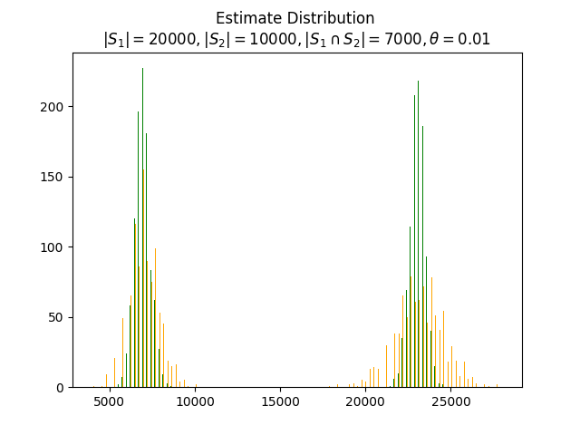
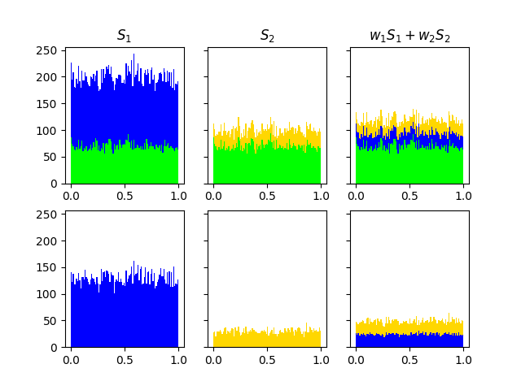

# Using Input Cardinalities To Improve Set Intersection Estimation

<figure>
  
  <figcaption>distributions of intersection and union estimates for uncorrected theta estimator (orange) and corrected (green) across many hash seeds</figcaption>
</figure>

## Abstract 

A fundamental problem in data sketches is accurately estimating the cardinality of the union or intersection of sampled sets. Sampling bias in the inputs produces bias in the output. Ting has proposed combining component estimators to compensate for each source of bias, using partial information about cardinality of each component, and weighting each component separately, but the resulting weights are difficult to combine for more than two operands.

We explore here a slightly simpler problem of how to correct the output bias from multiple inputs, working from their true cardinalities to an estimate of bias in the sampled output set. We combine inputs with a weighted average to produce a single correction factor which is a ratio of cardinality estimates, between the full set and the sample. Applying this correction considerably reduces variance.

This technique extends to an arbitrarily large number of operands as a nearest-point problem on a convex hull, which may be easier to solve than other methods.

## Background

### Theta Sampling
Theta Sketches use a sample of the data taken with coordinated hashing, where a single hash function is applied to all sets being sketched, and items which fall below a setwise threshold $\theta$ are retained:

$h(S,\theta) = \{ x \in S: hash(x) < \theta \} $

The Theta estimator 

$\hat{N}(S,\theta) = \frac{|h(S,\theta)|}{\theta}$

is an unbiased estimator of S's cardinality. This estimate differs by a factor $|h(S,\theta)|/n = C$ from the true value, due to variance in the hash function.

To estimate C for the intersection or union of two set sketches, we will pursue best estimates for the numerator and denominator.

### Vector Embedding

Given a set $S$ of integers drawn from a range $\{1..N\}$, we can represent it as a vector $\vec S = (s_i) \in \mathbb{R}^N$ st $ s_i = 1 \iff i \in S $ and 0 otherwise. 

This embedding has the property that $\langle \vec S,\vec S \rangle = \vert S \vert$ and $\langle \vec S, 
\vec T \rangle = \vert S \cap T \vert$.

The primary purpose of this embedding is to capture congruency and orthogonality between different components, as identical or disjoint sets map to congruent or orthogonal vectors which cancel out in the above norm or inner product calculations.

## Weighted Averaging

<figure>
  
  <figcaption>top row: hash value histogram in each set, stacking the intersection (green) and difference(blue/yellow) in each set before and after weighting. bottom: differences only</figcaption>
</figure>

Weighted averaging allows us to reduce the "signal-to-noise" ratio of the average vs. either input, where the "signal" is the intersection, and the "noise" are two uncorrelated difference vectors. The weighted average always weights the intersection at 1, and we choose weights which minimize the other components.

Given two sets $S_i$ and $I = S_1 \cap S_2$ we can write them vectorwise as $ \vec S_i = \vec I + \vec R_i$ with $\vec R_1 \perp \vec R_2 $. We wish to find the weighted average of $ \vec S_i $ which minimizes distance to $\vec I$.

If $w_i$ are nonnegative weights summing to 1, the locus of weighted sums $w_1 \vec S_1 + w_2 \vec S_2$ is the hypotenuse of a right triangle with vertices $\vec I, \vec S_1, \vec S_2$, having its closest (Least Squares) point to $\vec I$ at 

$w_i \propto 1/||R_i||^2 \approx 1/(|S_i| - \hat{N}(|S_1 \cap S_2|, \theta)$.

Revisiting our vector embedding, 

## Weighted Correction

To estimate the ratio between the intersection true cardinality and the sampled version, we estimate each with the weighted averaging method shown above:

$$ C = \frac{w_1 | S_1 | + w_2 | S_2 |}{w_1 \hat{N}(S_1, \theta)  + w_2 \hat{N}(S_2, \theta)}$$

using weights based on the difference between the cardinality and the approximate intersection size:

$$ w_i = 1/(|S_i| - \hat{N}(|S_1 \cap S_2|, \theta) $$

